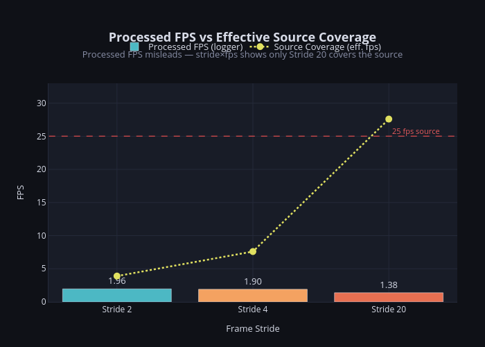
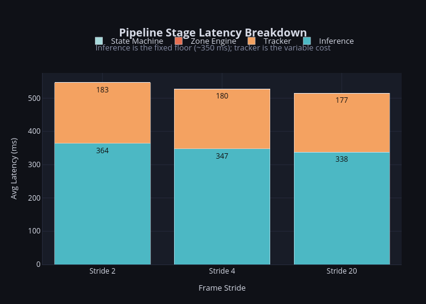
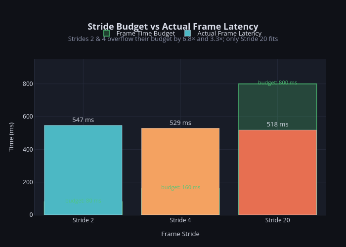
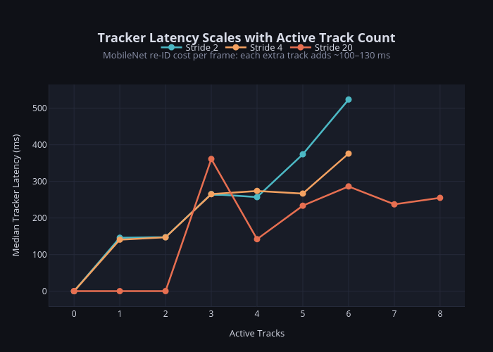

# Experiment Report: Frame Stride vs Real-Time Intrusion Detection

> **Date:** 2026-07-23  
> **Device:** `FSPI1` — Raspberry Pi 5  
> **Repo:** `sultan-rrcat/vigilai` · `edge/` module  
> **Author:** Sultan (Trainee)

---

## Table of Contents

- [Experiment Report: Frame Stride vs Real-Time Intrusion Detection](#experiment-report-frame-stride-vs-real-time-intrusion-detection)
  - [Table of Contents](#table-of-contents)
  - [1. Setup \& Configuration](#1-setup--configuration)
    - [Hardware](#hardware)
    - [Software \& Model](#software--model)
    - [Experiment Design](#experiment-design)
  - [2. Raw Results](#2-raw-results)
    - [2.1 Throughput \& Latency](#21-throughput--latency)
    - [2.2 Stage Latency Breakdown](#22-stage-latency-breakdown)
    - [2.3 Resource Utilisation](#23-resource-utilisation)
    - [2.4 Tracking Load](#24-tracking-load)
  - [3. Observations](#3-observations)
    - [O1 — The FPS Paradox](#o1--the-fps-paradox)
    - [O2 — Inference Is the Fixed Bottleneck](#o2--inference-is-the-fixed-bottleneck)
    - [O3 — Tracker Cost Scales with Track Count](#o3--tracker-cost-scales-with-track-count)
    - [O4 — CPU Is Fully Saturated](#o4--cpu-is-fully-saturated)
    - [O5 — RAM Growth with Active Tracks](#o5--ram-growth-with-active-tracks)
  - [4. Limitations](#4-limitations)
  - [5. Suggestions for Improvement](#5-suggestions-for-improvement)
    - [5.1 Model Optimisation (highest leverage)](#51-model-optimisation-highest-leverage)
    - [5.2 Tracker Optimisation](#52-tracker-optimisation)
    - [5.3 Runtime / Architecture](#53-runtime--architecture)
    - [5.4 Recommended Interim Configuration](#54-recommended-interim-configuration)

---

## 1. Setup & Configuration

### Hardware

| Property | Value |
|---|---|
| Device | Raspberry Pi 5 (`FSPI1`) |
| CPU | ARM Cortex-A76, **4 cores**, up to 2400 MHz |
| CPU Flags | NEON/ASIMD, AES, SHA, CRC32 (no NPU/GPU) |
| Total RAM | 3.9 GiB |
| Available RAM | ~3.2 GiB |
| Swap | 1.0 GiB |

### Software & Model

| Property | Value |
|---|---|
| Runtime | ONNX Runtime (CPU Execution Provider) |
| Model | `yolo26n_coco_local_1.onnx` (YOLO v2.6-nano, COCO) |
| Tracker | DeepSORT with MobileNet re-ID |
| `min_dwell_seconds` | 2.0 s |
| `track_ttl_seconds` | 5.0 s |
| Camera ID | `7cf8c777-0199-4ddf-afa0-2fcee1043dd2` |
| Python env | `venv` @ `~/projects/ids/edge` |

### Experiment Design

The **same pre-recorded video** was processed three times with `frame_stride` set to **2**, **4**, and **20**.  
Per-frame telemetry was streamed as NDJSON: timestamp, FPS, stage latencies (inference / tracker / zone engine / state machine), active track count, CPU %, and RSS memory.

| Stride | Frames logged | Run duration |
|---|---|---|
| 2 | 612 | ~7.5 min |
| 4 | 300 | ~2.8 min |
| 20 | 60 | ~44 s |

**Total records analysed: 972**

---

## 2. Raw Results

### 2.1 Throughput & Latency

| Metric | Stride 2 | Stride 4 | Stride 20 |
|---|---|---|---|
| Avg processed FPS | 1.96 | 1.90 | 1.38 |
| Max processed FPS | 2.81 | 2.68 | 1.87 |
| Avg frame latency (ms) | 547 | 529 | 518 |
| P95 frame latency (ms) | 873 | 858 | 822 |
| Frames with `fps=0` | 17.2 % | 17.3 % | 21.7 % |
| **Effective source coverage** | **3.9 fps (16%)** | **7.6 fps (30%)** | **27.6 fps (110%)** |

> _Effective source coverage = `processed_fps × stride`. At 25 fps source, only Stride 20 keeps up._

### 2.2 Stage Latency Breakdown

| Stage | Stride 2 (ms) | Stride 4 (ms) | Stride 20 (ms) |
|---|---|---|---|
| **Inference** | **364.2** | **347.4** | **337.8** |
| Tracker | 182.7 | 180.3 | 177.3 |
| Zone Engine | 0.02 | 0.02 | 0.03 |
| State Machine | 0.02 | 0.03 | 0.08 |
| **Total (mean)** | **547.4** | **528.6** | **518.3** |

> _Tracker active (re-ID running) in ~67% of all frames across all strides._  
> _Tracker ms when active: ~265–273 ms; when idle (0 tracks): < 1 ms._

### 2.3 Resource Utilisation

| Metric | Stride 2 | Stride 4 | Stride 20 |
|---|---|---|---|
| Avg CPU % (process) | 383 | 382 | 364 |
| Peak CPU % | 399 | 395 | 384 |
| Avg RSS RAM (MB) | 1018.7 | 1017.7 | 1019.9 |
| Peak RSS RAM (MB) | 1040 | 1035 | 1037 |

> _CPU % is reported as a process total across all threads. 400% = all 4 cores fully used._

### 2.4 Tracking Load

| Metric | Stride 2 | Stride 4 | Stride 20 |
|---|---|---|---|
| Max simultaneous tracks | 6 | 6 | 8 |
| Avg active tracks | 2.19 | 2.45 | 3.13 |

---

## 3. Observations

### O1 — The FPS Paradox

**Increasing stride _lowers_ the logged FPS, but that is the correct and expected behaviour.**

The logger's `fps` field measures how fast the pipeline _processes_ frames — not how well it keeps up with the live source.  
With stride 2, the video queue is permanently overflowing: the pipeline has an 80 ms budget per frame but takes ~547 ms, so it processes frames back-to-back with zero idle time and logs ~1.96 fps.  
With stride 20, the pipeline finishes each frame (~518 ms) within the 800 ms budget, then **waits** before the next frame is due — reducing logged fps to ~1.38 fps.  
The drop in logged FPS reflects the pipeline _catching up to real time_, not becoming slower.

| Stride | Budget (ms) | Actual (ms) | Overflow | Queue state |
|---|---|---|---|---|
| 2 | 80 | 547 | **6.8×** | Always backlogged |
| 4 | 160 | 529 | **3.3×** | Always backlogged |
| 20 | 800 | 518 | — fits ✓ | Idle time between frames |

### O2 — Inference Is the Fixed Bottleneck

ONNX-CPU inference takes **338–365 ms per frame** regardless of stride or scene complexity.  
This is dictated by the model's FLOPs and the Cortex-A76's NEON throughput with no GPU/NPU offloading.  
The per-stride delta is only ~26 ms (364 ms → 338 ms), confirming that reducing stride cannot meaningfully reduce inference time — a hardware or model change is required.

The inference floor alone exceeds:
- The entire per-frame budget at stride 2 (80 ms)
- The entire per-frame budget at stride 4 (160 ms)
- Nearly half the budget at stride 20 (800 ms)

### O3 — Tracker Cost Scales with Track Count

The MobileNet re-ID step runs **once per tracked object per processed frame**.  
With 1–2 active tracks, tracker latency is ~140–150 ms.  
With 5–6 tracks it reaches 380–650 ms, pushing total frame time above 900 ms and collapsing FPS from ~2 to ~1.

| Active tracks | Typical tracker ms |
|---|---|
| 0 (skip) | < 1 ms |
| 1–2 | 140–150 ms |
| 3–4 | 250–380 ms |
| 5–6 | 380–650 ms |

This is the single largest **variable** cost and the main driver of latency spikes.

### O4 — CPU Is Fully Saturated

Process CPU hovers at **~380% (~95% of all 4 cores)** during active tracking.  
There is no headroom for concurrent processes — MQTT broker, RTSP re-mux, alert dispatcher, or a second camera stream would immediately cause contention.  
Stride 20 reduces CPU to ~364%, providing a marginal ~16% breathing room.

### O5 — RAM Growth with Active Tracks

Baseline memory with no tracks is ~**768 MB**.  
Each additional DeepSORT track adds ~**40–60 MB** (appearance gallery, Kalman state, feature buffer).  
Peak RSS reached **1040 MB** at 6 concurrent tracks — well within the 3.2 GiB available.  
However, if camera multiplexing is added (multiple streams), RAM growth scales linearly and could become a constraint.

---

## 4. Limitations

| # | Limitation | Impact |
|---|---|---|
| L1 | **No NPU/GPU** — ONNX runs entirely on Cortex-A76 NEON cores | Inference floor is 8× the budget for a 25 fps stream |
| L2 | **Stride 20 creates 760 ms blind windows** — 19 of 20 source frames are never seen | At 1.2 m/s walking speed, a person moves ~0.9 m between analysed frames; tracks fragment and dwell-time under-counts |
| L3 | **Strides 2 & 4 never catch up** — the input queue grows unboundedly over time | Processing effectively happens on a delayed, non-real-time replay of the stream |
| L4 | **Tracker latency is unbounded** — no cap on simultaneous tracks | 6+ concurrent objects cause >900 ms frames and FPS collapse to ~1 fps |
| L5 | **Single-camera test only** — results may differ with different scene motion complexity or resolution | Cannot generalise to multi-camera or high-motion scenes |
| L6 | **`fps=0` in ~17–22% of records** — logger emits zero-FPS rows when two frames are processed within the same second | These records skew any naïve mean-FPS calculation downward |
| L7 | **Short Stride 20 run (44 s, 60 records)** — statistical sample is small compared to stride 2 (612 records) | Per-stride comparison may not fully represent steady-state behaviour |

---

## 5. Suggestions for Improvement

### 5.1 Model Optimisation (highest leverage)

| Action | Expected gain |
|---|---|
| **INT8 post-training quantisation** of `yolo26n_coco_local_1.onnx` | 2–3× inference speedup on Cortex-A76 NEON; no accuracy loss for detection |
| **Reduce input resolution** (e.g., 416→320→224) | Quadratic FLOP reduction with modest accuracy trade-off |
| **XNNPACK or NNAPI delegate** in ONNX Runtime | ARM-optimised kernel fusion; may push inference below 150 ms |

### 5.2 Tracker Optimisation

- **Cap `max_tracks`** (e.g., 4) to hard-limit tracker latency; excess detections are dropped instead of causing unbounded latency growth.
- **Batch re-ID embeddings** — currently MobileNet runs sequentially per track; batching all tracks in a single forward pass may reduce re-ID time by 30–50%.
- **Reduce re-ID frequency** — only run the full MobileNet embedding every N frames per track; use cheap IoU-based matching in between.

### 5.3 Runtime / Architecture

- **Dedicated inference thread with async tracker** — decouple ONNX inference from DeepSORT so the tracker pipeline does not block the next frame's inference.
- **Frame drop with quality gate** — instead of striding blindly, drop frames that are too similar to the previous one (low optical-flow magnitude), preserving analysis budget for motion events.
- **Hardware upgrade** — a Hailo-8L (13 TOPS), Google Coral Edge TPU, or Raspberry Pi AI HAT+ would reduce inference to **<20 ms**, making stride 1–2 fully viable.

### 5.4 Recommended Interim Configuration

Until hardware or model improvements are applied, **Stride 4** is the best operational compromise:

- Covers **30% of the source stream** (vs 16% at stride 2, 110% at stride 20)
- Blind window of only **120 ms** (3 frames) — a person moves ~0.14 m, keeping track continuity intact
- Only **~9 ms more mean latency** than stride 20
- Still over-budget (529 ms vs 160 ms budget) but processes 2× more unique temporal information than stride 20

---

*Report generated from `edge/perf.jsonl` telemetry — 972 frames, 3 stride configurations.*  
*Analysis performed: 2026-07-23.*